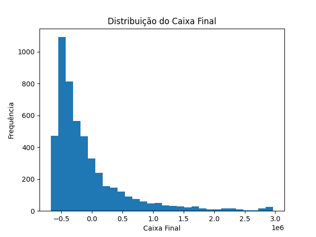
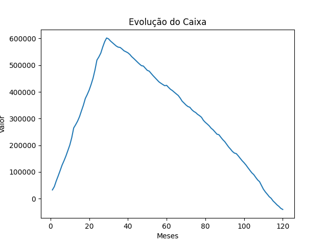
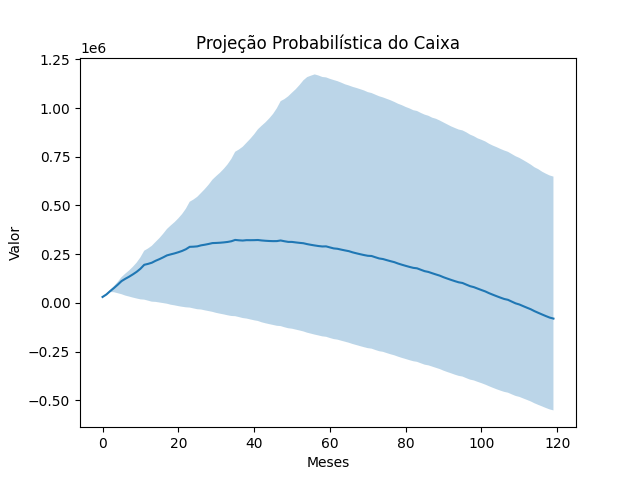

# Finance Analytics Pipeline


Simulador financeiro desenvolvido em Python para gerar cenários econômicos, simular fluxo de caixa e aplicar **simulação de Monte Carlo** para avaliação de risco financeiro.

O projeto gera dados simulados de receitas, custos e caixa ao longo do tempo e permite explorar os resultados por meio de **análise exploratória em Jupyter Notebook**.

---

## Contexto do projeto

A ideia deste projeto surgiu a partir de uma experiência prática na gestão financeira de uma organização comunitária, onde atuo como tesoureira.

Durante essa experiência, percebi a dificuldade de analisar cenários financeiros futuros apenas com base em registros históricos simples de entradas e saídas. Isso motivou a criação de um simulador capaz de gerar cenários econômicos e ajudar na análise de sustentabilidade financeira ao longo do tempo.

Inicialmente o projeto foi pensado apenas como um **gerador de dados simulados de fluxo de caixa**, mas evoluiu para algo mais completo: um **simulador financeiro com análise probabilística**, capaz de apoiar a tomada de decisões através de técnicas como **simulação de Monte Carlo**.

O objetivo é explorar perguntas como: 

- Qual o risco de uma organização ficar sem caixa no futuro?
- Como variações econômicas podem afetar receitas e despesas?
- Qual o impacto de crescimento ou redução de contribuições ao longo do tempo?

A partir dessas simulações, é possível gerar métricas financeiras e visualizar cenários que ajudam na compreensão do risco e da sustentabilidade do sistema financeiro analisado.

---

## Objetivo

Este projeto tem como objetivo demonstrar técnicas utilizadas em **análise de dados financeiros**, incluindo:

- Simulação de fluxo de caixa
- Modelagem de cenários econômicos
- Simulação de Monte Carlo
- Geração automática de datasets
- Análise exploratória de dados
- Visualização de resultados

---

## Arquitetura do simulador

O projeto foi estruturado com separação clara de responsabilidades para facilitar manutenção, evolução e adaptação do modelo.

A lógica do sistema está dividida em três componentes principais:

- **`conf.py`**
    Arquivo responsável pelas **configurações e parâmetros do modelo**, incluindo taxas econômicas, probablidades, limites financeiros e cenários. Isso permite ajustar o comportamento da simulação sem modificar o motor do sistema.
- **`simulation_engine.py`**
    Contém o **motor da simulação**, onde são implementadas as regras de negócio, geração de transações, eventos econômicos, cálculo de métricas e execução das simulações Monte Carlo.
- **`main.py`**
    Responsável pela **execução do pipeline**, chamando a simulação, gerando os datasets e exibindo os resultados.

Essa separação permite que o modelo seja facilmente adaptado para diferentes cenários financeiros apenas modificando parâmetros no arquivo de configuração (`conf.py`).

---

## Tecnologias utilizadas

- Python
- Pandas
- Matplotlib
- Jupyter Notebook

## Estrutura do projeto

```bash

finance-analytics-pipeline
│
├── analysis
│   └── exploracao_simulacoes.ipynb
│
├── data
│   ├── 01_simulacao.csv
│   └── 02_montecarlo.csv
│
├── docs
│   ├── distribuicao_caixa.png
│   ├── evolucao_caixa.png
│   └── projecao_probabilistica.png
│
├── conf.py
├── simulation_engine.py
├── main.py
│
├── requirements.txt
└── README.md
```

---

## Instalação

Clone o repositório:

```bash
git clone https://github.com/marinizedeev/finance-analytics-pipeline.git
cd finance-analytics-pipeline
```

Instale as dependências:

```bash
pip install -r requirements.txt
```

---

## Como executar

Execute o simulador principal:

```bash
python main.py
```

O sistema irá:

1. Rodar a simulação financeira
2. Executar múltiplas simulações de Monte Carlo
3. Gerar arquivos CSV na pasta `data`
4. Exibir gráficos de análise

---

## Análise de dados

Após gerar os dados, abra o notebook:

```bash
analysis/exploracao_simulacoes.ipynb
```

No notebook é possível:

- Carregar os datasets gerados
- Analisar estatísticas
- Visualizar distribuições
- Explorar cenários financeiros

---

## Exemplos de análise

Algumas análises possíveis com os dados gerados:

- Evolução do caixa ao longo do tempo
- Distribuição de resultados da simulação Monte Carlo
- Análise de risco financeiro
- Comparação entre cenários

---

## Exemplos de resultados







---

## Possíveis melhorias futuras

- Adicionar mais variáveis econômicas
- Implementar cenários macroeconômicos
- Criar dashboard interativo
- Automatizar geração de relatórios

## Autora

Marinize Santana
Projeto desenvolvido como prática de **engenharia de dados e análise financeira com Python**.