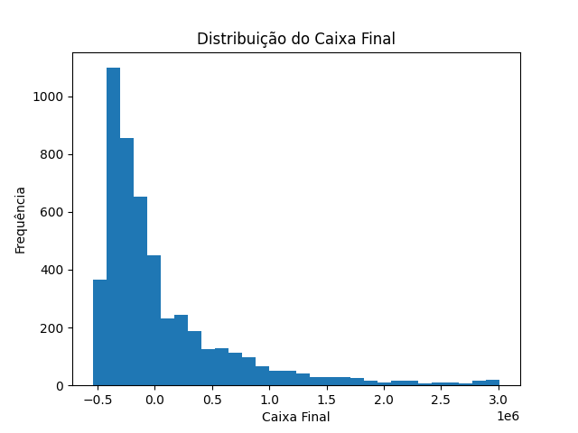
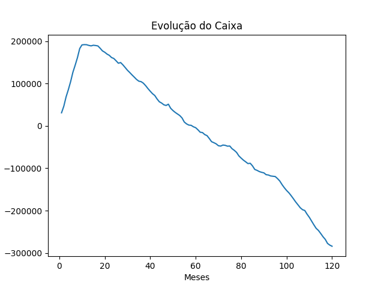
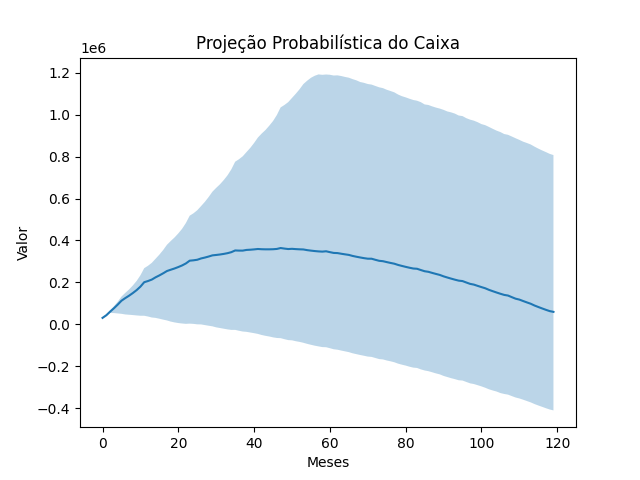

# Finance Analytics Pipeline — V2


Simulador financeiro desenvolvido em Python para gerar cenários econômicos, simular fluxo de caixa e aplicar **simulação de Monte Carlo** para avaliação de risco financeiro.

O projeto gera dados simulados de receitas, custos e caixa ao longo do tempo e permite explorar os resultados por meio de **análise exploratória em Jupyter Notebook**.

> **Versão atual: 2.4.0 (07/09/2026).** Esta versão amplia a parametrização do modelo, removendo regras de negócio hardcoded do motor e centralizando novos parâmetros em `conf.py`. A evolução também inclui cobertura automatizada das novas regras configuráveis. O histórico técnico completo está em [CHANGELOG.md](CHANGELOG.md).

---

## Contexto do projeto

A ideia deste projeto surgiu a partir de uma experiência prática na gestão financeira de uma organização comunitária, onde atuo como tesoureira.

Durante essa experiência, percebi a dificuldade de analisar cenários financeiros futuros apenas com base em registros históricos simples de entradas e saídas. Isso motivou a criação de um simulador capaz de gerar cenários econômicos e ajudar na análise de sustentabilidade financeira ao longo do tempo.

Inicialmente o projeto foi pensado apenas como um **gerador de dados simulados de fluxo de caixa**, mas evoluiu para algo mais completo: um **simulador financeiro com análise probabilística**, capaz de apoiar a tomada de decisões através de técnicas como **simulação de Monte Carlo**.

O objetivo é explorar perguntas como:

- Qual o risco de uma organização ficar sem caixa no futuro?
- Como variações econômicas podem afetar receitas e despesas?
- Qual o impacto de crescimento ou redução de contribuições ao longo do tempo?

A partir dessas simulações, é possível gerar métricas financeiras e visualizar cenários que ajudam na compreensão do risco e da sustentabilidade do sistema financeiro analisado.

---

## Objetivo

Este projeto tem como objetivo demonstrar técnicas utilizadas em **análise de dados financeiros**, incluindo:

- Simulação de fluxo de caixa
- Modelagem de cenários econômicos
- Simulação de Monte Carlo
- Geração automática de datasets
- Análise exploratória de dados
- Visualização de resultados
- Testes automatizados de regras de negócio
- Parametrização de cenários e comportamentos do modelo

---

## Arquitetura do simulador

O projeto foi estruturado com separação clara de responsabilidades para facilitar manutenção, evolução e adaptação do modelo.

A lógica do sistema está dividida em três componentes principais:

- **`conf.py`**
    Arquivo responsável pelas **configurações e parâmetros do modelo**, incluindo taxas econômicas, probabilidades, limites financeiros, faixas de variação, duração de crises e parâmetros da simulação Monte Carlo.
- **`simulation_engine.py`**
    Contém o **motor da simulação**, as regras de negócio, a geração de transações e eventos econômicos, a análise Monte Carlo e os componentes responsáveis pelo processamento e visualização dos resultados.
- **`main.py`**
    Responsável pela **execução do pipeline**, chamando a simulação, gerando os datasets e exibindo os resultados.

A separação entre configuração e lógica facilita a adaptação do modelo para diferentes cenários financeiros, permitindo ajustar grande parte dos parâmetros diretamente em `conf.py`, sem alterar o fluxo principal do motor.

## Evolução arquitetural — V2

A primeira versão separava configuração, motor e execução, mas o motor concentrava regras em funções globais e representava o estado com dicionários. Isso dificultava localizar responsabilidades, testar regras isoladas e evoluir o domínio sem aumentar o acoplamento.

Na V2, os elementos do negócio passaram a ter representação explícita:

| Componente | Responsabilidade |
| --- | --- |
| `EstadoFinanceiro` | Mantém caixa, reserva, membros e histórico; aplica transações e usa a reserva quando necessário. |
| `EstadoEconomico` | Representa inflação, crise e seus impactos no período. |
| `Transacao` e `RegistroMensal` | Modelam movimentações e resultados mensais com tipos próprios. |
| `ResultadoSimulacao` | Representa o resultado final da simulação e disponibiliza os dados para análise. |
| `SimuladorFinanceiro` | Executa regras de negócio e produz um `ResultadoSimulacao`. |
| `AnaliseMonteCarlo` | Executa cenários repetidos e calcula indicadores de risco. |
| `GeradorGraficos` | Isola a responsabilidade de visualização das regras financeiras do simulador. |

Essa mudança preserva a interface de execução e os arquivos de saída da V1, mas deixa o projeto mais testável, previsível e preparado para novas regras. A utilização da reserva, antes existente como função isolada, também passou a integrar o fluxo real da simulação.

### Rastreabilidade da evolução

- **V1:** funções e dicionários, com separação inicial entre configuração, motor e execução.
- **V2:** domínio modelado por classes, responsabilidades isoladas, gerador aleatório injetável para reprodutibilidade e cobertura automatizada de regras críticas.
- **V2.1:** logging centralizado com o módulo padrão `logging`, substituindo mensagens de execução com `print` e adicionando rotação de arquivos.
- **V2.2:** regras financeiras foram descompactadas em métodos com nomes de domínio; o fator econômico voltou a ser explícito e o impacto de crise nos custos ganhou teste dedicado.
- **V2.3:** configurações legadas e redundantes foram removidas para manter uma única fonte de verdade por regra financeira.
- **V2.4:** novas regras de negócio foram parametrizadas em `conf.py`, incluindo comportamento mensal dos membros, custos imprevistos, duração de crises, inflação, fator econômico e percentis do Monte Carlo. A suíte de testes foi ampliada para validar essas configurações.
- Cada mudança relevante deve ser registrada em [CHANGELOG.md](CHANGELOG.md), preservando a história técnica do projeto.

---

## Tecnologias utilizadas

- Python
- Pandas
- Matplotlib
- Jupyter Notebook
- `unittest`
- `logging`

---

## Estrutura do projeto

```bash

finance-analytics-pipeline
│
├── analysis
│   └── exploracao_simulacoes.ipynb
│
├── data
│   ├── 01_simulacao.csv
│   └── 02_montecarlo.csv
│
├── docs
│   ├── distribuicao_caixa.png
│   ├── evolucao_caixa.png
│   └── projecao_probabilistica.png
│
├── conf.py
├── simulation_engine.py
├── main.py
├── tests
│   └── test_simulation_engine.py
│
├── CHANGELOG.md
├── requirements.txt
└── README.md
```

---

## Instalação

Clone o repositório:

```bash
git clone https://github.com/marinizedeev/finance-analytics-pipeline.git
cd finance-analytics-pipeline
```

Instale as dependências:

```bash
pip install -r requirements.txt
```

---

## Como executar

Execute o simulador principal:

```bash
python main.py
```

O sistema irá:

1. Rodar a simulação financeira
2. Executar múltiplas simulações de Monte Carlo
3. Gerar arquivos CSV na pasta `data`
4. Gerar gráficos de análise

## Testes automatizados

A V2 utiliza a biblioteca padrão `unittest`, portanto não exige biblioteca adicional de testes além das dependências já necessárias ao projeto.

Para executar toda a suíte:

```bash
python -m unittest discover -s tests -v
```

A suíte atual possui **15 testes automatizados**, cobrindo regras essenciais do domínio, incluindo:

- atualização de caixa por tipo de transação;
- uso da reserva financeira;
- contenção de custos;
- eventos planejados;
- aplicação de impactos de crises;
- estrutura dos resultados;
- reprodutibilidade com semente aleatória;
- logging em modo de depuração;
- análise de Monte Carlo;
- parametrização do crescimento e saída de membros;
- parametrização de custos imprevistos;
- parametrização da duração de crises;
- parametrização do fator econômico.

Os testes utilizam `patch` e geradores aleatórios controlados quando necessário para validar comportamentos determinísticos e garantir que as configurações centralizadas sejam efetivamente utilizadas pelo motor.

---

## Logs

As mensagens do pipeline utilizam o módulo padrão `logging` — não há mensagens de execução com `print`.

Os logs são emitidos no terminal e salvos em:
`logs/finance_pipeline.log`

O arquivo possui rotação automática para limitar o uso de disco.

O nível e a retenção são configuráveis em `conf.py`:

- `LOG_NIVEL`: nível mínimo registrado, como `INFO` ou `DEBUG`.
- `LOG_ARQUIVO`: caminho do arquivo de log.
- `LOG_MAX_BYTES`: tamanho máximo de cada arquivo de log.
- `LOG_BACKUP_COUNT`: quantidade de arquivos rotacionados mantidos.

O arquivo de log é ignorado pelo Git; assim, o repositório mantém a configuração versionada sem incluir saídas locais de execução.

---

## Parametrização do modelo

As regras ajustáveis da simulação ficam centralizadas em `conf.py`, reduzindo a necessidade de modificar o motor para experimentar diferentes cenários.

Entre os parâmetros configuráveis estão:

- cenário econômico;
- inflação anual;
- crescimento médio das contribuições;
- comportamento mensal dos membros;
- probabilidades de eventos;
- faixas de valores de eventos e custos imprevistos;
- duração das crises econômicas;
- impactos de crises sobre doações, membros e custos;
- fator de contenção de custos;
- fator de risco e volatilidade;
- quantidade de simulações de Monte Carlo;
- percentis utilizados na projeção probabilística.

Essa abordagem permite alterar hipóteses do modelo preservando o fluxo principal da aplicação.

---

## Análise de dados

Após gerar os dados, abra o notebook:

```bash
analysis/exploracao_simulacoes.ipynb
```

No notebook é possível:

- Carregar os datasets gerados
- Analisar estatísticas
- Visualizar distribuições
- Explorar cenários financeiros
- Avaliar resultados das simulações

---

## Exemplos de análise

Algumas análises possíveis com os dados gerados:

- Evolução do caixa ao longo do tempo
- Distribuição de resultados da simulação Monte Carlo
- Análise de risco financeiro
- Comparação entre cenários
- Projeção probabilística do caixa

---

## Exemplos de resultados







---

## Possíveis melhorias futuras

- Criar objetos de configuração para substituir as constantes globais de `conf.py`
- Adicionar mais variáveis econômicas e cenários macroeconômicos
- Criar dashboard interativo
- Automatizar geração de relatórios
- Adicionar integração contínua para executar os testes a cada alteração

## Autora

Marinize Santana → estudante de Análise e Desenvolvimento de Sistemas.

Projeto desenvolvido como prática de **engenharia de dados e análise financeira com Python**.
